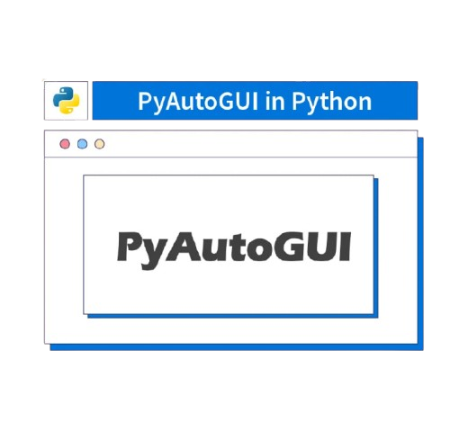

# CURSO DE PYAUTOGUI
👨‍⚖️PYAUTOGUI É UMA BIBLIOTECA PYTHON QUE PERMITE AUTOMATIZAR A INTERAÇÃO COM A INTERFACE GRÁFICA DO USUÁRIO (GUI).

  

## CONCEITO:  
PyAutoGUI é uma biblioteca Python usada para automação da interface gráfica do usuário (GUI). Com ela, é possível simular ações como mover o mouse, clicar, digitar textos e interagir com janelas de programas, facilitando a automação de tarefas repetitivas.

## SUA HISTÓRIA:  
O PyAutoGUI foi criado por Al Sweigart, um autor conhecido por seus livros de programação, como *Automate the Boring Stuff with Python*. A biblioteca foi desenvolvida para simplificar a automação de tarefas em diferentes sistemas operacionais (Windows, macOS e Linux), sem precisar interagir diretamente com as APIs de cada um.

## CARACTERÍSTICAS:  
### POSITIVAS:  
- Compatível com Windows, macOS e Linux.  
- Fácil de usar, com comandos simples e intuitivos.  
- Permite automação de tarefas como cliques do mouse, teclas do teclado e captura de tela.  
- Pode ser usada para testes automatizados de interface gráfica.  
- Útil para preencher formulários automaticamente ou interagir com programas sem APIs disponíveis.  

### NEGATIVAS:  
- Não detecta elementos gráficos diretamente (como botões ou campos de texto), exigindo reconhecimento por coordenadas ou imagens.  
- Sensível a mudanças na interface (se uma janela mudar de posição, o código pode falhar).  
- Pode ser bloqueado por alguns aplicativos que impedem automação de GUI por segurança.  
- Não é ideal para automação em segundo plano, pois requer que a interface gráfica esteja visível.  

## SUBSIDIOS:
- [CURSO CRIADO PELO "I LOVE PYTHON"](https://youtube.com/playlist?list=PLptqHZ6pdXKqCvWr2ZbcWjPVPk1B6pUUB&si=aT5WTrY-jqlFjxYR)
- [CURSO FEITO PELO VILHALVA](https://github.com/VILHALVA)
- [VEJA A DOCUMENTAÇÃO](https://pyautogui.readthedocs.io/en/latest/)
- [LINGUAGEM DE PROGRAMAÇÃO](https://github.com/VILHALVA/CURSO-DE-PYTHON)
- [VEJA O MANUAL](./MANUAL.md)
- [VEJA OS PROJETOS](https://github.com/VILHALVA?tab=repositories&q=topic:PYAUTOGUI)